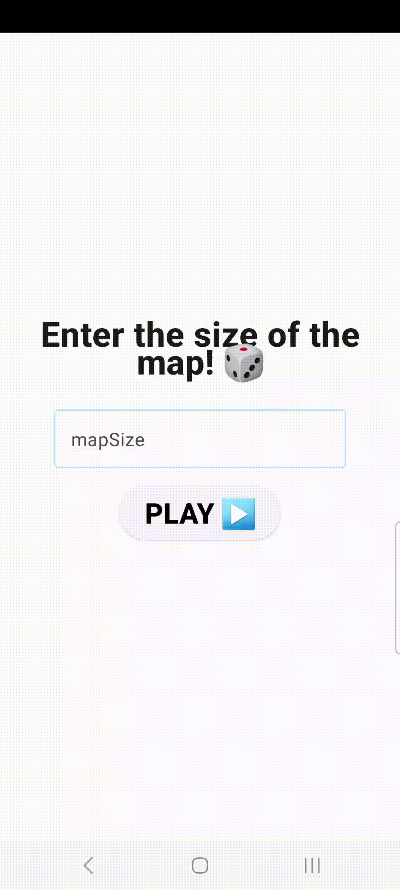

# Tic-Tac-Toe Android App

A Jetpack Compose Android Tic-Tac-Toe game written in Kotlin.

  

## Table of contents

- [Tic-Tac-Toe Android App](#tic-tac-toe-android-app)
  - [Table of contents](#table-of-contents)
  - [Features](#features)
  - [Demo](#demo)
  - [APK Download](#apk-download)

## Features

- navigation with `jetpack-compose`
- arbitrary map size selection with validation
- haptic feedback (vibration)
- supports multiple orientations, preserving state
- winning sequence(s) detection and visualization

## Demo

| &nbsp;&nbsp;&nbsp;&nbsp;&nbsp;&nbsp;Map&nbsp;size&nbsp;&nbsp;&nbsp;&nbsp;&nbsp;&nbsp;&nbsp; validation | &nbsp;&nbsp;Winning&nbsp;with&nbsp;&nbsp;&nbsp; a single pattern | &nbsp;&nbsp;Winning&nbsp;with&nbsp;&nbsp;&nbsp; multiple patterns | &nbsp;&nbsp;Replay&nbsp;button&nbsp;&nbsp; | &nbsp;Multiple&nbsp;screen  orientations support |
| :---:| :---: | :---: | :----: | :---: |
|        |                     |                |   |                         |

## APK Download

The newest APK release is available for [download here](https://github.com/Xintre/TicTacToe/releases).

It is automatically built with GH Actions [Continous Delivery workflow](./.github/workflows/cd.yml).
